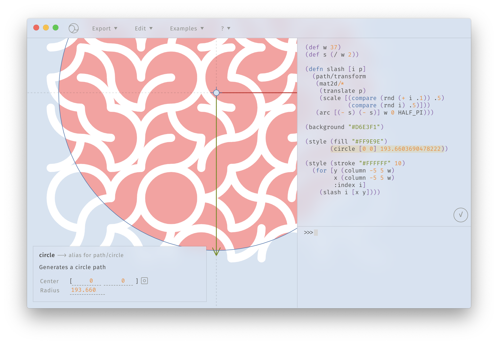

# What's Glisp?

In short, Glisp is a project to explore **the next-generation design tool that is extremely extensible, flexible, and can be used in various ways**. Mainly developed by [Baku Hashimoto](https://baku89.com), it is developed as open source with the cooperation of many [contributers](https://github.com/baku89/glisp/graphs/contributors) and [sponsors](https://github.com/sponsors/baku89?o=sd&sc=t).

At present, it is still a prototype, though, we will eventually develop it into a general-purpose vector graphics tool that anyone can use.

## Graphical Lisp

As its name implies, the large part of features of Glisp is built on the programming language **Lisp**. While we'll leave the details to [another chapter](why-lisp), Lisp has the notable property that it is both program and data. This duality is called "[code as data](https://en.wikipedia.org/wiki/Code_as_data)" or [homoiconicity](https://en.wikipedia.org/wiki/Homoiconicity) . Therefore, Glisp can use Lisp not only for scripting but also for various data representations such as project files, plugins, and even application settings. And since they are also the programs themselves, it means that each function can be modified, automated, and hacked with the equivalent level of flexibility as programming.

By this design, Glisp can cherry-pick both advantages of "repetitive, manual approach by hand that direct-manipulation tool likes Illustrator provide, and power of self-bootstrapping and generative expression which are enabled by programming.

## Features for Features

Another important design concept of Glisp is the principle of providing **functions to build functions**, rather than the functions for a concrete purpose. Even as for the vector graphics editor, the existing apps tend to be designed for a specific genre and purpose in mind. Take Adobe products as an example:

- **InDesign**: book design
- **Illustrator**: flyers, illustrations, and diagrams
- **XD** UI/UX design

This sort of specialization is especially efficient as long as you use it within its proper usage. But once you try something strange, such the limitation often lets you take hacky and detour way. And you also have to use various tools according to the type of tasks.

On the other hand, Glisp's approach can be said as the motto "**Don't assume who will use it for what**". An artist might want to draw an abstract picture, a mockup for smartphone app, or even a floor plan. Instead of providing specific features for each use, Glisp provides abstracted features that artists themselves can use to implement features that fit their purpose. One example is the function to define whatever primitives as you want, while most apps only provide built-in ones such as ellipses, rectangles, and regular polygons. In the screenshots below is the scene defining and re-using smiley primitive.

Like this way, Glisp's major nature is that its functionality will evolve and "metamorphose" in any way depending on your purpose, style, and habit to design.

## Outlook

The ultimate goal of this project is **to make the digital design tools on the earth better** (in the sense of the author). Of course, we hope Glisp itself to become a useful tool that can be used by creators around the world. However, since I, Baku Hashimoto is neither specialized in tool development nor interested in it compared to making things with it, it'd be fine if everyone would understand the merits of such a concept of digital design and be ripped off by vendors like Adobe, Figma, and Maxon which develop the products that I've used. Hopefully, I may be be able to focus on my own creation with less frustration thanks to their improved tools in the near future.

<small>\* To be honest, I would like to find a way to monetize the project, at least for myself and contributers. Because the development took much time than I imagined, and I won't do a client work especially for advertisement anymore... It'd be appreciated if you consider to [sponsor me](https://github.com/sponsors/baku89?o=sd&sc=t).</small>
