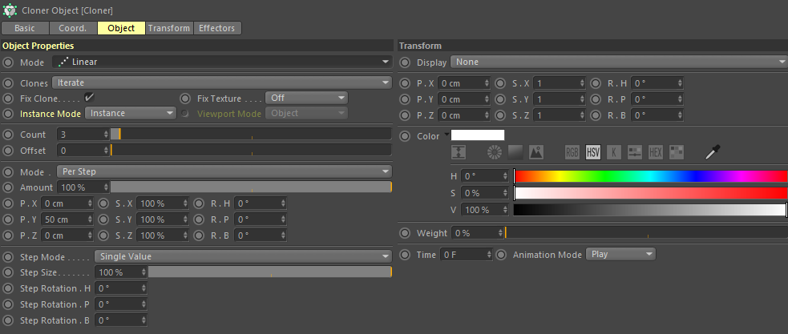

# なぜ Lisp なのか

## データとしてのコード

Glisp が多くのクリエイティブコーディング環境と違うのは、それが**手続き的**ではなく**宣言的**であるということです。こうしたスケッチがあるとします。

```cljs
(style (fill "LightSeaGreen")
 (circle [50 50] 40))
```

Processing に慣れている方は、このような書き方のほうが馴染みがあるでしょう。

```js
fill('LightSeaGreen')
circle(50, 50, 40)
```

それぞれの行は

- まず、塗りの色をサーモンに設定しなさい
- 次に、中心(100, 100)、半径 40 の円を描きなさい

という**手続き**として解釈することができます。一方で Glisp のコードは「ここにこういうものがあります」という**宣言**からなるデータの集まりとして読み下すほうが自然です。HTML の文章構造にも似ています。冒頭の例は、SVG ではこのように表現できるでしょう。

```svg
<g fill="LightSeaGreen">
  <circle cx="50" cy="50" r="40">
</g>
```

そして実際に、Glisp のコードはある種の木構造からなるデータでもあります。

```clojure
┬─ style
├─┬─ fill
│ └─ "LightSeaGreen"
└─┬ circle
  ├─┬─ 50
  │ └─ 50
  └─ 40
```

このような構造を「抽象構文木」といいます。どのプログラミング言語も、一度この構文木を経て機械語に翻訳されますが、Lisp がユニークなのは、同じ構文木をデータ構造の表現としてもプログラムとしてもどちらでも解釈することができるという特徴です。例えば JSON はデータ形式であると同時にそれ自体が JavaScript の文法のサブセットになっているため、コードとしても実行することができます。Lisp はそうした性質が言語全体に及んでいます。

このような設計を**同像性**、あるいは **Code as Data（データとしてのコード）** 、と呼ぶそうです。Lisp では、コードとデータの区別をしません。なぜなら、コード自身もまたリストというデータから出来ているからです。Lisp はこの同像性によって他の言語にはない様々な性質を手にすることになりますが、それは別の章に譲るとして、以下は Lisp コードをプロジェクトファイルとして使うことで得られるメリットを解説したいと思います。

## 従来のプロジェクトファイルの問題

話はそれますが、AfterEffects のプロジェクトファイルは XML 形式で保存することもできます。ですから、頑張ればメモ帳アプリで編集することも出来ます。強引に言ってしまうと、AfterEffects はただの XML エディタです。メモ帳との違いは、AfterEffects はとんでもなくグラフィカルなので、その背後にあるデータ構造を意識せずとも編集が済んでしまうというだけの話です。

しかし、XML はあくまでも静的なデータですから、プロジェクトの中で動的にレイヤーを増やしたりプロパティを設定したりということがそのままでは出来ません。大抵のソフトのプロジェクトファイルが直面する制約なのですが、ここでソフト開発者は２つの対策を取る場合が多いです。

1.  動的操作のための拡張構文を作る
2.  エクスプレッション言語を埋め込む

1 は、XML の例で言うと、その機能のためのタグを作るようなものです。以下は疑似コードです。例えば Illustrator のブレンド機能をプロジェクトファイル上で表現したいならば、そのための `<blend/>` タグを作ってやって、こうします。

```xml
<blend steps="10">
  <pathA ...>
  <pathB ...>
</blend>
```

あるいは、あるアイテムの配置を変えながら指定の個数だけ複製できるレプリケーター機能であれば、こんな感じになるでしょうか。

```xml
<replicator count="10" step="translate(25, 0)">
  <circle cx="100" cy="100" r="50">
</replicator>
```

しかしこの方法の弱点は、デザイナー自身によって拡張構文を定義することが出来ないということです。これはデザイナー自身にとって不利益なだけでなく、開発者にとっても面倒をおこします。なぜなら、拡張構文をつくるにしたって、すべてのデザイナーが欲しいであろう機能を不足なく盛り込んであげる必要があるからです。結果として、往々にしてこうした拡張構文に対応する UI はゴチャゴチャしがちです。



2 の**エクスプレッション言語を埋め込む**という方法ですが 3DCG ソフトは Python、Adobe 系ソフトは JavaScript が使われることが多いようです。

```xml
<circle center:expression="[thisComp.width / 2, thisComp.height]"
        radius:expression="thisComp.width / 2">
```

この方法の弱点は、ソフト開発者が API として開放した機能しかエクスプレッションから操作出来ないということ、エクスプレッションの編集はテキストの形でしかできないということです。

## 自己拡張性

もし、プロジェクトファイル自身でプロジェクトファイルの構文を拡張できたとしたらどうでしょうか。プロジェクトファイルとそこに埋め込まれるスクリプト言語との区別が無いとすればどうでしょう。ここに**「なぜ Lisp なのか」**の答えがあります。Lisp も XML と同じような木構造のデータです。そしてプログラミング言語としての性質を備えながら、構文はとてもシンプルなので、読み込みも、 GUI のためのデータとして流し込むことも容易です。

1 の例は、Glisp の場合、クローナー機能自身をプロジェクトファイルの内側で実装することができます。

```cljs
;; replicator の定義
(defn replicator
  [xform n path]
  (->> (range n)
       (map #(apply mat2d/* (repeat xform %)))
       (map #(transform % path))))

(style (stroke "tomato" 2)

 ;; X+方向に10ずつ移動させながら5個複製する
 (replicator (translate-x 10) 5
  (circle [30 50] 20)))
```

もちろん `replicator` 関数は、ソフトのロード時にプラグインとして読み込むことも可能でしょう。

そして Glisp は、クローナー機能に限らず、`rect` 関数といったビルトインの図形や機能も全く同じように Lisp によって定義されています。つまり、ユーザーが定義した機能とプラグイン、ビルトイン機能の区別が無いということです。それらはすべて同じ Lisp によって書かれており、その違いは**「どのタイミングでロードされるか」**だけです。

2 の場合も、Glisp ではこのようになります。エクスプレッション部分もアイテム定義部分も同じ Lisp で書かれているので、実装用言語で書かれた機能をエクスプレッション言語からアクセスできるよう開放する API という考え方がそもそも必要ありません。また、エクスプレッションにあたる部分を GUI として表示することも容易です。

```cljs
(style (fill "plum")
 (circle [(/ *width* 2) *height*] (/ *width* 2)))
```

一歩踏み込んだ話をすると、Glisp ではソフト上のエクスポートといった機能もまた Lisp コマンドとして実行しています。つまり、ソフト操作のバッチ処理やスクリプティングにも Lisp が使えるということです。

## 移植が容易

また、Lisp をプロジェクトファイルに使うもう一つの良さは移植性の高さです。文法もシンプルなのでパーサーは簡単に実装出来ます。実際に Glisp で使われているパーサーは、様々な言語に Lisp を実装する [**Make-A-Lisp（MAL）**](https://github.com/kanaka/mal)という学習プロジェクトを元にしています。MAL は 80 異常の言語で実装されているため、Glisp のコードのパーサーをより高速な他の言語で実装するときの参考になります。

また、Glisp の多くの関数が、実装元のホスト言語（この例では JavaScript）ではなく Glisp のコード自身によって書かれているため、移植する際にも IO などのコア部分だけをホスト言語で記述し直せば事足ります。
